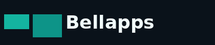
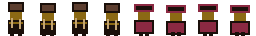

# Lampião Souls

Jogo de plataforma 2D ambientado no sertão, com movimento, pulo, arma e fases em estilo *Souls-like* leve (cenários com risco e progressão).

  

  

## Tecnologias

| Ferramenta | Uso |
|------------|-----|
| **[Godot Engine 4](https://godotengine.org/)** | Motor do jogo (2D, física, cenas, input) |
| **GDScript** | Lógica do jogador, estágios, projéteis, metas e zonas de dano |
| **TileMap + TileSet** | Cenários a partir de mapas ASCII e *tileset* do sertão |
| **CanvasItem / Forward+** | Renderização 2D (configuração do projeto) |

## Requisitos

- [Godot 4.x](https://godotengine.org/download) (recomendado 4.4 ou superior)

## Como executar

1. Clone este repositório.
2. Abra o Godot e use **Importar** apontando para a pasta do projeto (onde está `project.godot`).
3. Execute a cena principal (**F5** ou botão Play).

## Controles

| Ação | Entrada |
|------|---------|
| Mover | Setas ou **A** / **D** |
| Pular | Espaço ou seta **Cima** |
| Atirar | **X** |

## Estrutura (resumo)

- `scenes/` — cenas do menu, jogador, projétil e fases
- `scripts/` — GDScript do gameplay
- `assets/` — *sprites*, *tileset* e UI

## Licença

Defina a licença desejada (por exemplo MIT) se o repositório for público.
